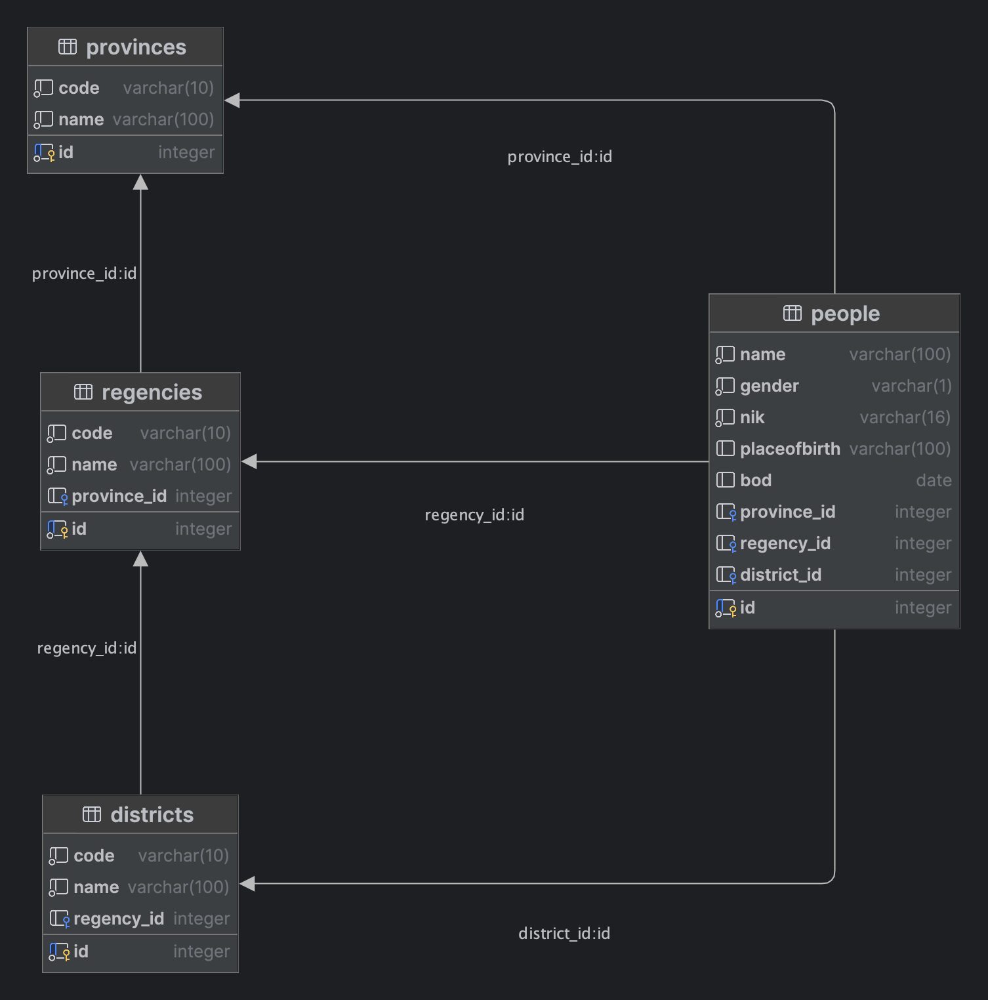

# Livecode Starter Pack

## Material Scope
- Springboot

## Kendala
Kamu sedang bertugas sebagai Tenaga Ahli di **Dinas Kependudukan dan Pencatatan Sipil**.
Suatu ketika Kepala Dinas meminta mu membuat kan sebuah aplikasi yang bisa mendata penduduk dan menggenerate NIK (Nomor Induk Kependudukan) dimana NIK tersebut terdiri dari:
1. tidak lebih dan kurang dari 16 digit
2. dua digit pertama merupakan kode provinsi
3. dua digit berikutnya merupakan kode kab/kota
4. dua digit berikutnya merupakan kecamatan
5. enam digit berikutnya terdiri dari *tanggal-bulan-tahun* dimana jika:
    - gender perempuan maka tanggal ditambahkan 40 `e.g` tanggal 4 jadi `4 + 40 = 44`
    - gender pria tetap
6. empat digit terakhir adalah urutan (*random/increment*), `0001`, `0002`, `0003` dst
7. Validasi untuk Jam Layanan yaitu hanya pada jam 8 - 14 selain itu keluarkan pesan `Layanan Pembuatan KTP Sudah tutup`
8. Validasi untuk Hari Layanan yaitu hanya ada Senin-Jumat selain itu keluarkan pesan `Layanan Pembuatan KTP hanya Senin-Jumat`
9. Cek NIK jika sudah pernah buat atau terdaftar maka keluarkan pesan `NIK anda sudah terdaftar`
10. hasil akhir adalah `1801053303921003`

## Kriteria
1. CRUD Data Provinsi
2. CRUD Data Kabupaten/Kota
3. CRUD Data Kecamatan
4. CRUD Penduduk sekaligus Generate NIK

## Ketentuan
### Cara 1
Silahkan `clone` project ini untuk memulai `livecode` kemudian buat `repository` baru di subgrup `livecode` dengan nama `livecode-springboot-data-penduduk`.

Setelah itu hapus dahulu remote yang ada dengan cara berikut:
1. Cek remote saat ini:
   ```bash
   git remote -v
   ```
2. Jika sudah tertera remote `origin` maka hapus dulu dengan cara berikut:
   ```bash
   git remote remove origin
   ```
3. Setelah itu baru masukkan remote baru anda sesuai dengan project yang dibuat sebelumnya `livecode-springboot-data-penduduk`
   ```bash
   git remote add origin <url-repository>
   ```
### Cara 2
Cara kedua silahkan buat project baru.
   
## ERD


**Note**:
- Jangan merubah desain yang sudah di buat di atas.

## REST API Contract
Silahkan lakukan import `collection` untuk uji coba aplikasi download file `DATA-PENDUDUK-APP.postman_collection.json` atau download disini [Collection](DATA-PENDUDUK-APP.postman_collection.json)

Tata cara lakukan import dapat di cek di url berikut https://apidog.com/blog/how-to-import-export-postman-collection-data/